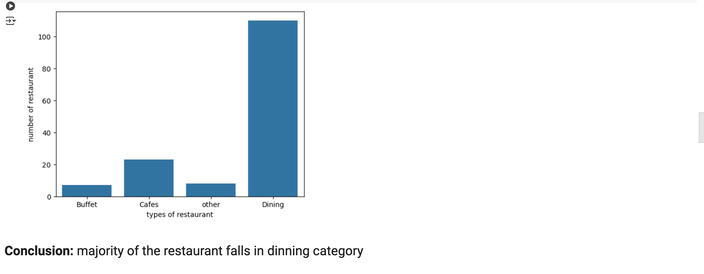

#Zomato Data Analysis 🍽️

This project analyzes Zomato restaurant data to derive insights into customer preferences, restaurant performance, and market trends. It involves data cleaning, visualization, and statistical analysis.

🔧 Libraries Used

Pandas 📊 – Data cleaning & manipulation (handling missing values, filtering, grouping).
NumPy 🔢 – Efficient numerical computations (mean, correlations).
Matplotlib 📈 – Visualizing trends in ratings, pricing, and locations.
Seaborn 🎨 – Creating heatmaps, bar charts & pair plots for insights.

📊 Key Insights Analyzed

✔️ Which restaurant type attracts the most customers (Buffet, Café, Dining, etc.)

✔️ Which type of restaurant gets the highest votes & ratings

✔️ What’s the average order cost for two people?

✔️ Which restaurant type receives more offline orders?

✔️ Does online or offline mode get better ratings?

